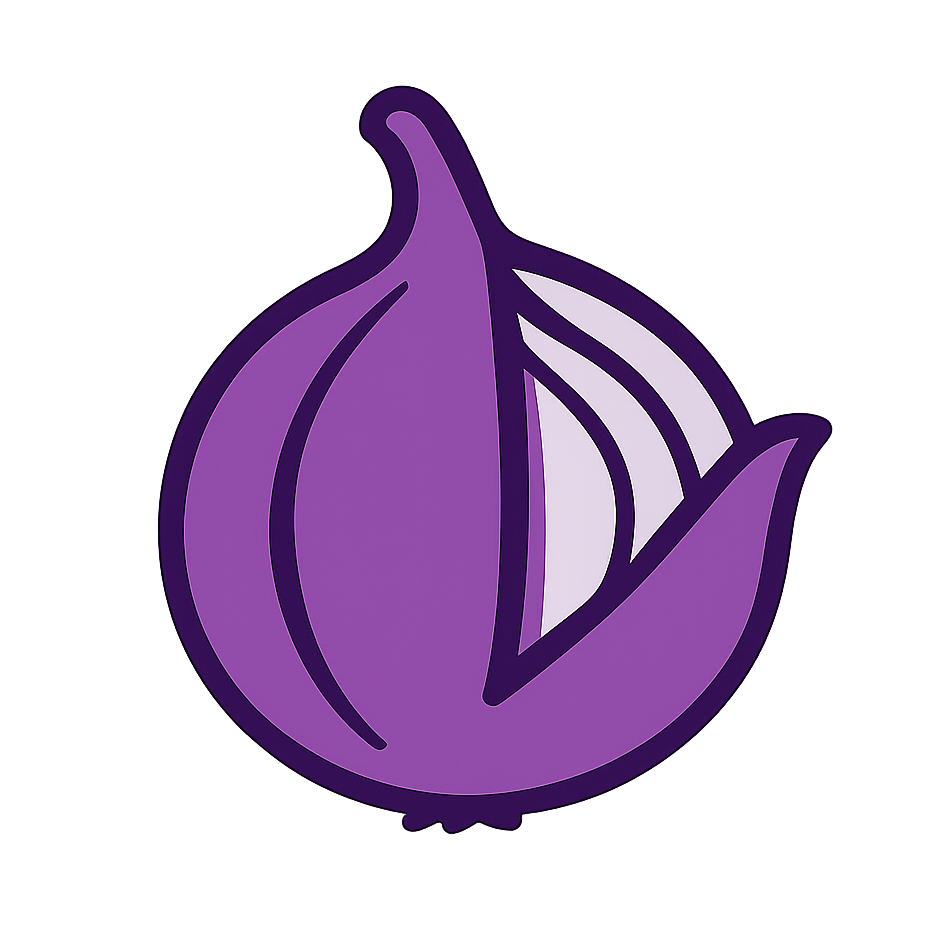

  
  <h1>Let's peel the onion</h1>

  

## Features

- 🚀 **Quick Start** - Create a full-stack application in seconds
- 🔄 **Multi-Framework Support** - Vue/React frontend and NestJS backend
- 🛠️ **Modern Development Tools** - TypeScript, ESLint, Prettier, and more
- 📦 **Flexible Build Options** - Choose your UI framework, state management, API layer, and more
- 🎨 **Choose Your Style** - Tailwind CSS, UnoCSS or just plain CSS
- 🔌 **Plugin System** - Easily extend and add features as needed
